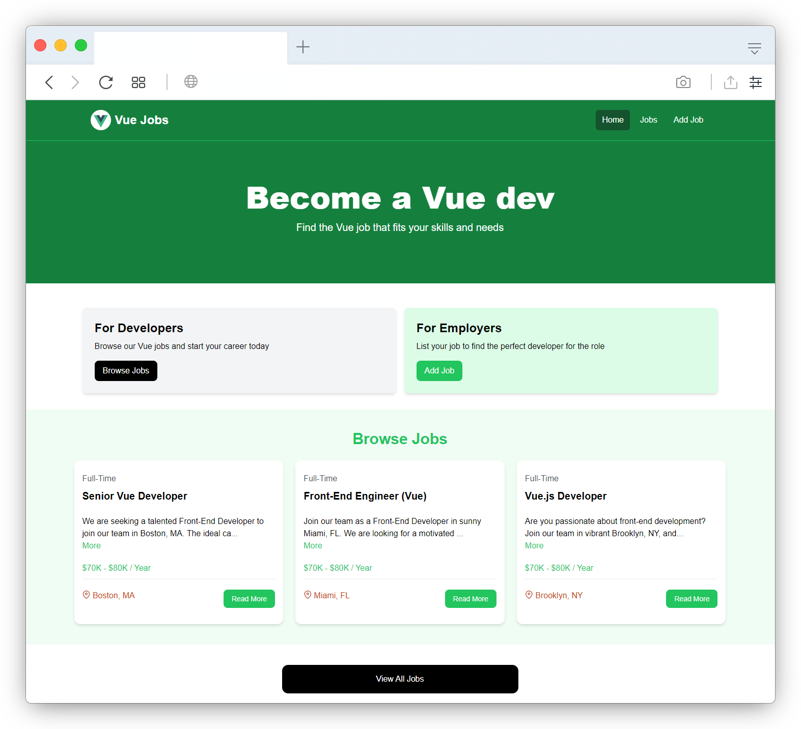

## Vue Jobs Project

This template should help get you started developing with Vue 3 and TypeScript in Vite. The template uses Vue 3 `<script setup>` SFCs, check out the [script setup docs](https://v3.vuejs.org/api/sfc-script-setup.html#sfc-script-setup) to learn more.

Learn more about the recommended Project Setup and IDE Support in the [Vue Docs TypeScript Guide](https://vuejs.org/guide/typescript/overview.html#project-setup).



## Usage

This project uses JSON-Server for a mock backend.

### Install Dependencies

```bash
yarn
```

### Run JSON Server

The server will run on http://localhost:8000

```bash
yarn server
```

### Run Vite Frontend

Vue will run on http://localhost:3000

```bash
yarn dev
```

### Build for Production

```bash
yarn build
```

### Preview Production Build

```bash
yarn preview
```